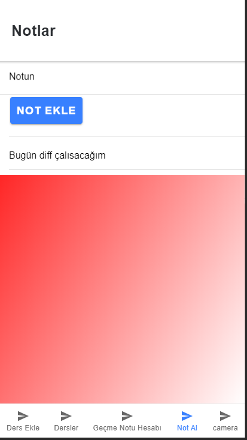

## Öğrenci Destek Uygulaması

Uygulama açıldığında sisteme kaydolma veya giriş yapma ekranı gelmektedir. 
Kullanıcı kayıt/giriş yaptıktan sonra ana sayfaya yönlendirilmektedir. 
Kullanıcı ana sayfadan diğer sayfalara erişir. 
Kullanıcı sisteme ders ekleyip bu dersleri listeleyebilmektedir.
Uygulama üzerinden kullanıcı girdiği vize notu ve vize notunun etkisiyle dersi geçmek için final sınavından kaç alması gerektiği bilgisini alır. 
Uygulama üzerinden kullanıcılar not alıp bu notları düzenleyip silerbilirler.

#

### Geliştiriciler
- **150201127 Mehmet Emin Arslan**

#

### Uygulamada Kullanılan modüller, sayfalar ve amaçları
- #### **`Students` Modülü**
Kullanıcı bu modül üzerinden sisteme ders ekleyip eklediği dersleri listeleyebilir. Geçme notu hesaplama sayfasında ise dersin vize notunu ve vizenin etkisini girerek dersten geçmek için finalden kaç alması gerektiğinin bilgisini alır. Not ekle sayfasında ise kullanıcı notlar ekleyip o notları düzenleyebilir. Notlar firebase realtime databasede tutuluyor. Kamera sayfasında ise kullanıcı telefondan kamerayı açıp kullanabiliyor.

- #### **`Register` ve `Login` Sayfaları**
Kullanıcılar sisteme kayıt olup kayıt olduğu e-mail şifre ile sisteme giriş yapmaktadırlar. Kullanıcı eğer sisteme giriş yapmadan login ya da register sayfaları dışındaki sayfalara erişmek isterse guard yardımıyla bu durum engellenir. Kullanıcının giriş bilgileri firebasede tutulmaktadır.

# Öğrenci Destek Uygulaması Students Modülü

#### Mehmet Emin Arslan 150201127

### Modül özellikleri

Kullanıcı bu modül üzerinden sisteme ders ekleyip eklediği dersleri listeleyebilir.
Geçme notu hesaplama sayfasında ise dersin vize notunu ve vizenin etkisini girerek dersten geçmek için finalden kaç alması gerektiğinin bilgisini alır.
Not ekle sayfasında ise kullanıcı notlar ekleyip o notları düzenleyebilir. Notlar firebase realtime databasede tutuluyor.
Kamera sayfasında ise kullanıcı telefondan kamerayı açıp kullanabiliyor.

### Uygulama içi görüntüler

Kullanıcı bu sayfada sisteme ders ekleyebiliyor.Dersler sistemde dersler tablosu adı altında tutuluyor.

Kullanıcı bu sayfada dersi geçmek için ihtiyacı olan final notunu hesaplıyor

Kullanıcı bu sayfada not ekleyip eklediği notları düzenleyebiliyor(değiştirmek ve silmek).

